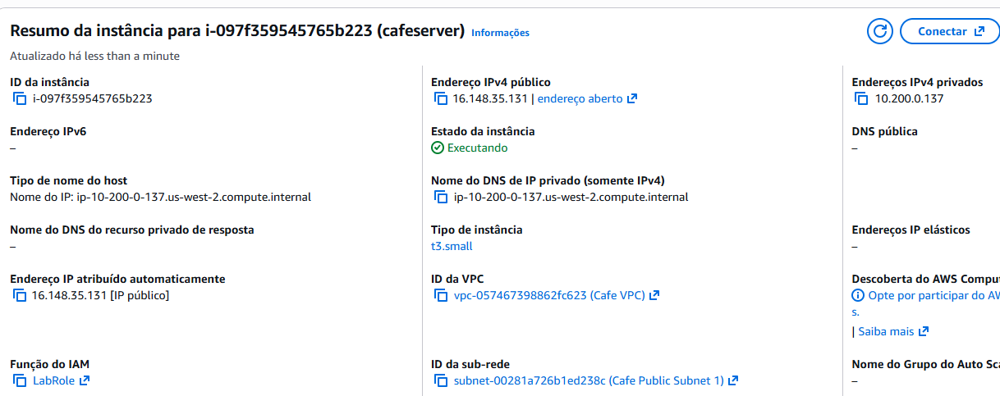
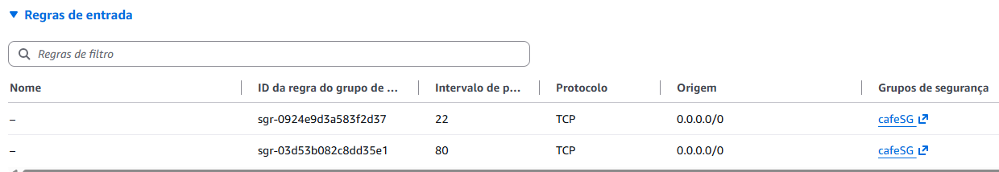
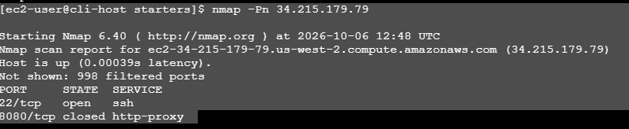
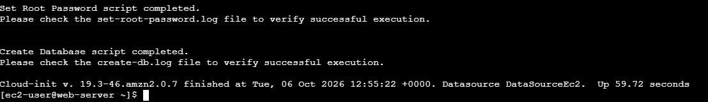
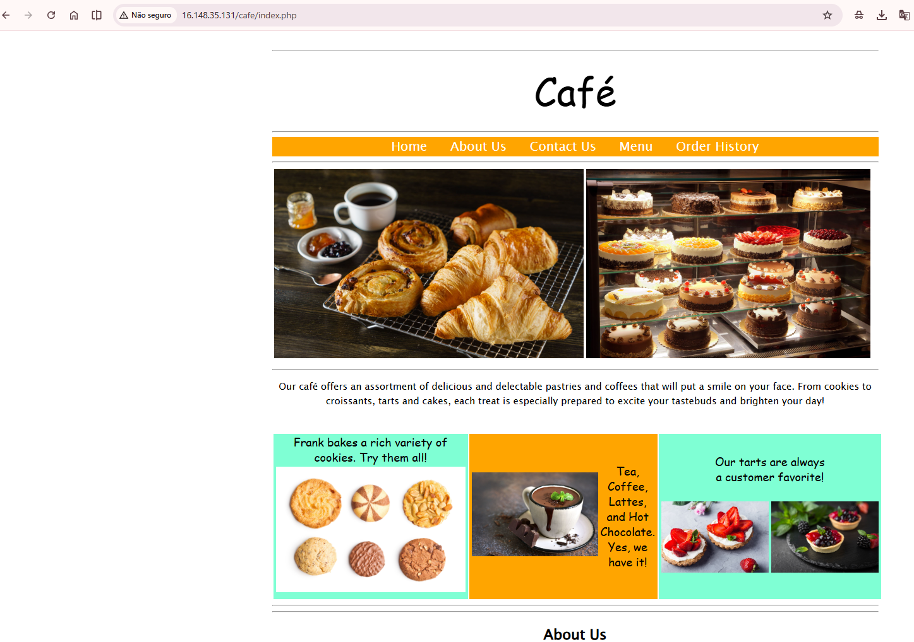
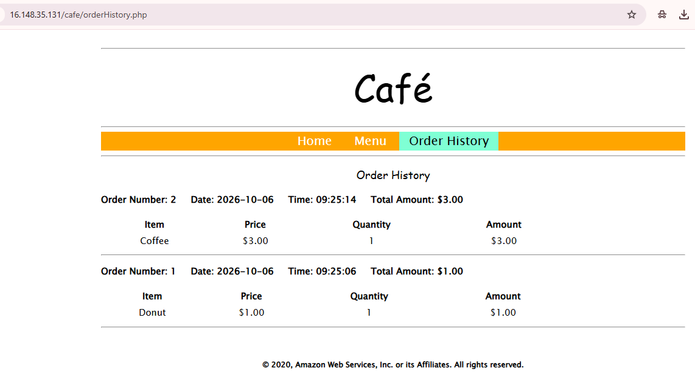

# AWS EC2 LAMP — Troubleshooting com AWS CLI

> Laboratório prático de troubleshooting em uma instância Amazon EC2, utilizando AWS CLI, Bash, Linux e ferramentas de diagnóstico para identificar e corrigir problemas de configuração em um servidor LAMP.

---

## 📌 Visão geral

Neste laboratório, o objetivo foi criar e configurar uma instância **Amazon EC2** por meio da **AWS CLI**, utilizando um script Bash fornecido pelo ambiente de treinamento.

A instância deveria executar uma aplicação web baseada em uma arquitetura LAMP:

* **Linux** — sistema operacional da instância
* **Apache** — servidor web
* **MariaDB** — banco de dados
* **PHP** — linguagem utilizada pela aplicação

O laboratório foi desenvolvido propositalmente com problemas de configuração no script. O desafio foi investigar os erros, identificar suas causas, aplicar as correções e validar o funcionamento completo da aplicação.

---

## 🎯 Objetivos

Durante o laboratório, foram praticadas as seguintes atividades:

* Configuração da AWS CLI.
* Execução e análise de um script Bash.
* Criação de uma instância EC2 através da AWS CLI.
* Identificação de problemas relacionados à região da AWS.
* Investigação de problemas de conectividade.
* Análise de Security Groups.
* Diagnóstico de portas utilizando Nmap.
* Verificação de serviços Linux utilizando `systemctl`.
* Análise do processo de inicialização utilizando Cloud-init.
* Instalação e configuração de Apache, PHP e MariaDB.
* Validação de uma aplicação web conectada a um banco de dados.

---

## ☁️ Ambiente utilizado

| Recurso                   | Configuração         |
| ------------------------- | -------------------- |
| Serviço principal         | Amazon EC2           |
| Região                    | `us-west-2`          |
| Sistema operacional       | Amazon Linux 2       |
| Instance Type             | `t3.small`           |
| Web Server                | Apache HTTP Server   |
| Linguagem                 | PHP                  |
| Banco de dados            | MariaDB              |
| Ferramenta de diagnóstico | Nmap                 |
| Automação                 | Bash + AWS CLI       |
| Inicialização             | Cloud-init           |
| Aplicação                 | Café Web Application |

---

## 🏗️ Visão simplificada da arquitetura

```text
                         AWS
                          │
                          ▼
                    ┌───────────┐
                    │   VPC     │
                    │           │
                    │  Public   │
                    │  Subnet   │
                    │           │
                    │ ┌────────┐│
Internet ──────────►│ │  EC2   ││
                    │ │ LAMP   ││
                    │ └───┬────┘│
                    │     │      │
                    └─────┼──────┘
                          │
                    ┌─────▼─────┐
                    │  MariaDB  │
                    └───────────┘
```

O acesso à aplicação ocorre pela porta HTTP `80`.

O acesso administrativo à instância ocorre pela porta SSH `22`.

---

# 🔎 Processo de Troubleshooting

## Problema 1 — AMI não encontrada

Durante a primeira execução do script, a criação da instância falhou com:

```text
InvalidAMIID.NotFound
```

### Investigação

A AMI utilizada pelo script era obtida através do parâmetro do Systems Manager:

```text
/aws/service/ami-amazon-linux-latest/amzn2-ami-hvm-x86_64-gp2
```

A consulta retornava uma AMI válida para a região:

```text
us-west-2
```

Porém, ao executar o `run-instances`, o script utilizava:

```bash
--region us-east-1
```

### Por que isso causou o problema?

As **Amazon Machine Images (AMIs)** são recursos específicos de uma região.

Uma AMI disponível em:

```text
us-west-2
```

não pode simplesmente ser utilizada diretamente em:

```text
us-east-1
```

Portanto, o ID da imagem existia, mas não naquela região.

### Correção

O parâmetro foi alterado de:

```bash
--region us-east-1
```

para:

```bash
--region $region
```

Dessa forma, o comando passou a utilizar a mesma região onde a AMI havia sido encontrada.

### Resultado

Após a correção, a instância EC2 foi criada corretamente em:

```text
us-west-2
```

---

# 🔎 Problema 2 — Aplicação web inacessível

Após a criação da instância, tentei acessar a aplicação pelo endereço IPv4 público.

O site não carregava.

Neste momento, em vez de alterar configurações aleatoriamente, comecei a investigar cada camada do problema.

---

## 1. Verificação do serviço Apache

Primeiro, foi verificado se o servidor web estava funcionando:

```bash
sudo systemctl status httpd
```

O resultado indicou:

```text
Active: active (running)
```

Isso mostrou que o Apache estava funcionando corretamente.

Portanto, o problema provavelmente não estava no serviço web.

---

## 2. Diagnóstico das portas com Nmap

Para verificar quais portas estavam acessíveis, foi utilizado:

```bash
nmap -Pn <IP>
```

O resultado mostrou:

```text
22/tcp    open     ssh
8080/tcp  closed   http-proxy
```

### Interpretação

A porta `22` estava aberta, permitindo acesso SSH.

Porém, a porta `8080` estava fechada.

Ao revisar o script, foi identificado um detalhe importante.

O script informava:

```text
Opening port 80 in the new security group
```

mas o comando efetivamente executava:

```bash
--port 8080
```

Havia, portanto, uma inconsistência entre o que o script dizia fazer e o que realmente configurava.

---

## 3. Correção do Security Group

A regra foi corrigida de:

```bash
--port 8080
```

para:

```bash
--port 80
```

A porta `80` é a porta padrão utilizada para tráfego HTTP.

Depois disso, o script foi executado novamente para criar a instância com o Security Group corrigido.

---

# 🧪 Validação

Após as duas correções, foram realizados novos testes.

## EC2

A nova instância foi criada com sucesso.

A instância final utilizada no laboratório foi:

```text
Instance ID: i-097f359545765b223
Availability Zone: us-west-2a
Instance Type: t3.small
Region: us-west-2
```

---

## 🔐 Security Group

O Security Group foi configurado para permitir:

| Porta | Protocolo | Finalidade |
| ----: | --------- | ---------- |
|    22 | TCP       | SSH        |
|    80 | TCP       | HTTP       |

---

## 🌐 Servidor Web

O Apache foi confirmado como ativo através do:

```bash
sudo systemctl status httpd
```

Resultado:

```text
Active: active (running)
```

---

# ⚙️ Cloud-init e User Data

A instância recebeu um script de **User Data** durante sua criação.

Esse script foi responsável por configurar automaticamente o ambiente LAMP.

Para verificar o processo de inicialização, foi analisado:

```bash
sudo cat /var/log/cloud-init-output.log
```

O log confirmou a execução das etapas de configuração.

Entre elas:

* instalação do PHP;
* instalação do MariaDB;
* instalação do Apache;
* inicialização dos serviços;
* download dos arquivos da aplicação;
* extração dos arquivos;
* configuração do banco de dados;
* criação da aplicação web.

O log terminou indicando a conclusão do processo de Cloud-init.

### Observação

Durante a instalação apareceram mensagens relacionadas ao `yum lock`, indicando que outro processo estava utilizando o gerenciador de pacotes naquele momento.

O processo continuou normalmente e as instalações foram concluídas.

Também foram exibidos avisos relacionados ao fim do suporte de versões antigas de PHP utilizadas pelo ambiente do laboratório. Esses avisos não impediram a execução da aplicação.

---

# ☕ Validação da aplicação Café

Depois da configuração do servidor, a aplicação foi acessada através de:

```text
http://<public-ip>/cafe
```

A página da aplicação carregou corretamente.

Foi então realizado um teste funcional:

1. Acesso ao menu.
2. Seleção de produtos.
3. Criação de um pedido.
4. Envio do pedido.
5. Criação de um segundo pedido diferente.
6. Consulta ao histórico de pedidos.
7. Confirmação de que os dois pedidos estavam registrados.

Esse teste confirmou que não apenas o servidor web estava funcionando, mas também que a aplicação estava conseguindo utilizar o banco de dados.

---

# 🔗 Fluxo completo validado

O laboratório permitiu validar o seguinte fluxo:

```text
Usuário
   │
   ▼
Internet
   │
   ▼
Security Group
   │
   │ HTTP :80
   ▼
Apache
   │
   ▼
PHP
   │
   ▼
Aplicação Café
   │
   ▼
MariaDB
   │
   ▼
Histórico de pedidos
```

---

# 📸 Evidências do laboratório

As principais evidências estão organizadas na pasta `screenshots/`.

### 01 — Instância EC2



Mostra a instância criada e suas principais configurações.

### 02 — Security Group



Mostra as regras de entrada utilizadas para SSH e HTTP.

### 03 — Diagnóstico com Nmap



Evidência utilizada durante a investigação do problema de conectividade.

### 04 — Cloud-init



Mostra a execução do processo de configuração automática da instância.

### 05 — Aplicação Café



Evidência de que a aplicação web estava acessível.

### 06 — Histórico de pedidos



Confirmação funcional de que os pedidos foram processados e registrados.

---

# 🧠 Principais aprendizados

Este laboratório foi importante principalmente porque mostrou que troubleshooting não significa simplesmente tentar configurações até alguma funcionar.

Foi necessário seguir uma sequência lógica:

```text
Problema
   ↓
Coleta de evidências
   ↓
Investigação
   ↓
Identificação da causa
   ↓
Correção
   ↓
Novo teste
   ↓
Validação
```

### Conceitos reforçados

* **EC2:** serviço de computação da AWS para executar servidores virtuais.
* **AMI:** imagem utilizada como modelo para criar uma instância EC2.
* **Region:** localização geográfica lógica onde os recursos da AWS são criados.
* **Security Group:** firewall virtual associado à instância.
* **Nmap:** ferramenta utilizada para investigar portas e serviços de rede.
* **Cloud-init:** mecanismo utilizado para executar configurações durante a inicialização da instância.
* **User Data:** script enviado à instância durante sua criação para automatizar configurações.
* **Apache:** servidor responsável por receber requisições HTTP.
* **PHP:** utilizado pela aplicação web.
* **MariaDB:** banco de dados utilizado pela aplicação.

---

# 💡 O que este laboratório demonstrou

Além da configuração dos serviços, este laboratório demonstrou a importância de:

* analisar mensagens de erro;
* verificar configurações antes de alterar recursos;
* utilizar ferramentas de diagnóstico;
* entender a relação entre região e recursos AWS;
* verificar portas de rede;
* analisar logs;
* validar cada camada da aplicação;
* utilizar a AWS CLI para automatizar tarefas;
* solucionar problemas de forma estruturada.

---

# 🏆 Resultado final

O laboratório foi concluído com sucesso.

Foram identificados e corrigidos dois problemas principais:

### 1. Região incorreta

O comando de criação da EC2 utilizava `us-east-1`, enquanto a AMI estava disponível em `us-west-2`.

**Correção:** utilização da variável `$region`.

### 2. Porta HTTP incorreta

O Security Group estava configurando a porta `8080`, enquanto a aplicação deveria utilizar a porta HTTP `80`.

**Correção:** alteração da porta `8080` para `80`.

Após as correções:

* a instância EC2 foi criada;
* o Apache foi executado;
* PHP e MariaDB foram configurados;
* o Security Group permitiu HTTP;
* o Cloud-init concluiu a configuração;
* a aplicação Café ficou acessível;
* pedidos foram realizados;
* o histórico confirmou o funcionamento do banco de dados.

---

## 💼 Competências praticadas

**AWS**

* Amazon EC2
* Security Groups
* AMI
* VPC
* Subnet
* AWS CLI
* Systems Manager Parameter Store

**Linux**

* Bash
* `systemctl`
* análise de logs
* gerenciamento de serviços
* instalação de pacotes
* Cloud-init

**Networking**

* TCP/IP
* portas
* HTTP
* SSH
* Security Groups
* Nmap

**Troubleshooting**

* análise de erros
* investigação por evidências
* identificação de causa raiz
* aplicação de correções
* validação pós-correção

---

## 📚 Conclusão

Este laboratório foi uma prática de administração de infraestrutura em nuvem e troubleshooting utilizando ferramentas de linha de comando.

O principal aprendizado foi entender que, diante de um problema, é necessário investigar o comportamento do sistema, coletar evidências e identificar a causa antes de aplicar uma correção.

A experiência também reforçou a integração entre **AWS, Linux, redes, servidores web, banco de dados e automação**, conhecimentos que fazem parte da minha formação e do meu objetivo de transição para a área de Tecnologia.
